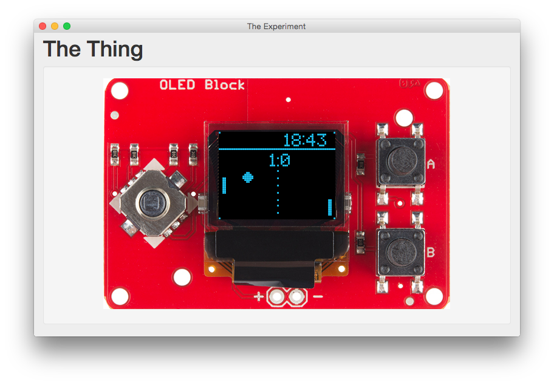

Oled Display Simulator
----------------------



This is a simple experiment to create a js-angular-canvas-nw based simulator of real device, to be able to prototype some software, emulate almost-real look-and-feel, etc. This project emulates `SparkFun Block for Intel® Edison - OLED` board, including user input and oled display output.

This is just a toy, so don't expect clean code or cool modularity of the whole project. This will however be used in some real prototyping of intel edison - based devices.

Try it
------

```bash
npm install
npm run compiler
npm run app
```

Links
-----

[SparkFun Block for Intel® Edison](https://www.sparkfun.com/products/13035)
